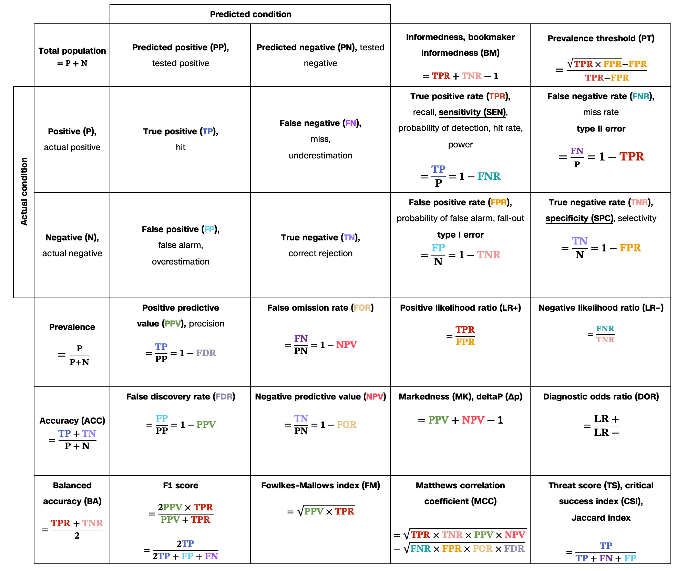

> Accuracy metrics are designed with logic, not invented. Think of 'correct' over 'total checks' is for kindergarteners.
## 1. Definitions
- In medicine and statistics, true positive and true negative mathematically describe the accuracy of a test that reports the presence or absence of a medical condition. 
- For all testing, both diagnoses and screening, there is usually a trade-off between sensitivity and specificity, such that higher sensitivities will mean lower specificities and vice versa.

This confusion matrix was colored from [the one on Wikipedia](https://en.wikipedia.org/wiki/Sensitivity_and_specificity#Confusion_matrix). Credits to whoever summarized these metrics to a comprehensible format.

### Interpretation of these metrics:
>Data points are equivalent to instances or individuals, model to designed test or audit method.
- **PP (Predicted Positives)**: The number of instances that the model predicted as positive. High values could indicate a bias toward positive predictions.
- **PN (Predicted Negatives)**: The number of instances that the model predicted as negative. High values may suggest a bias toward negative predictions.
 

- **TP (True Positives):** Indicates correctly predicted positive cases, representing success in identifying positive instances.
- **TN (True Negatives):** Indicates correctly predicted negative cases, showing effectiveness in recognizing negatives.
 
- **FP (False Positives)**: Represents negative instances misclassified as positive, which can lead to unnecessary actions or alerts (Type I error).
- **FN (False Negatives)**: Represents positive instances misclassified as negative, indicating potential missed opportunities or risks. (Type II error).
 
- **PPV (Positive Predictive Value)**: Also called **Precision**; measures how often positive predictions are correct. High precision implies fewer false positives, important when false alarms are costly.
- **NPV (Negative Predictive Value)**: Indicates how often negative predictions are correct. High NPV is critical when false negatives (missed detections) are costly.
 
- **FDR (False Discovery Rate)**: The proportion of false positives out of all predicted positives. Complementary to PPV. Shows the likelihood that a positive prediction is actually wrong, highlighting risk in incorrectly identifying positives.
- **FOR (False Omission Rate)**: The proportion of false negatives out of all predicted negatives. Complementary to NPV. Shows the likelihood that a negative prediction is actually wrong, helpful in understanding the reliability of negative results.
 
- **TPR (True Positive Rate)**: Also called **Sensitivity** or **Recall**; the proportion of true positives out of all actual positives. Measures the model’s ability to correctly identify actual positives, important in scenarios where missing positives (false negatives) is costly.
- **TNR (True Negative Rate)**: Also called **Specificity**; the proportion of true negatives out of all actual negatives. Measures the model’s ability to correctly identify actual negatives, essential where false positives are costly.
 
- **FPR (False Positive Rate)**: Shows the proportion of negatives incorrectly classified as positives, giving insight into the false alarm rate, completementary to TNR.
- **FNR (False Negative Rate)**: Shows the proportion of positives incorrectly classified as negatives, highlighting the model’s tendency to miss positives, complementary to TPR.
 
- **LR+ (Positive Likelihood Ratio)**: Ratio of TPR to FPR, indicating how much more likely a positive result is in a true positive case compared to a false positive. 
- **LR− (Negative Likelihood Ratio)**: Ratio of FNR to TNR, indicating how much more likely a negative result is in a false negative case compared to a true negative.
 
##### Lesser known/More advanced metrics:
- **DOR (Diagnostic Odds Ratio)**: Measures the odds of a correct prediction versus an incorrect one; higher values indicate a better diagnostic test.
- **ACC (Accuracy)**: Measures the overall correctness of the model across all predictions, giving a basic performance overview. Limited for imbalanced data.
- **BA (Balanced Accuracy)**: The average of sensitivity and specificity, useful for imbalanced datasets. 
- **F1 Score**: The harmonic mean of precision (PPV) and recall (TPR), balances precision and recall, useful for imbalanced data when both false positives and false negatives are costly.
- **BM (Bookmaker Informedness)**: Measures the probability that a prediction is informed (greater than chance).
- **MCC (Matthews Correlation Coefficient)**: A correlation coefficient between observed and predicted classifications, ranging from -1 to +1. Provides a balanced measure for binary classification, useful for imbalanced datasets, with -1 indicating complete disagreement and +1 perfect agreement.
- **TS (Threat Score or Critical Success Index)**: Measures the accuracy of positive predictions, commonly used in weather or event forecasting to weigh all positive instances.
- **PT (Prevalence Threshold)**: Suggests an optimal decision threshold for classifying positives and negatives, based on prevalence and the costs of false positives and false negatives.
## 2. Applications:
### 2.1. Common applications:
#### 2.1.1. Fraud Detection:
- **TPR**: Helps identify as many fraudulent transactions as possible (true positives), ensuring suspicious activity is flagged.
- **TNR**: Reduces false alarms by ensuring legitimate transactions aren’t wrongly flagged, minimizing customer inconvenience and operational costs.
#### 2.1.2. Product Quality Control:
- **TPR**: Ensures defects are caught during quality checks, reducing the chance of faulty products reaching customers.
- **TNR**: Minimizes unnecessary rejection of good products, which helps in avoiding waste and additional inspection costs.
#### 2.1.3. Marketing Campaign Targeting:
- **TPR**: Maximizes reach among likely buyers by correctly identifying most potential customers.
- **TNR**: Reduces costs by avoiding marketing to people unlikely to convert, improving ROI.
#### 2.1.4. Operations Agent Quality:
> *Ring any bells?*
- **TPR**: Enhances agent accuracy in taking the correct action. Such as labeling a bad data or provide the right refund amount.
- **TNR**: Issues are not incorrectly flagged, leading to unnecessary intervention.
 
### 2.2. Advanced applications:
In fields such as machine learning or medicine, some selected metrics are integral to model performance, e.g. data classification tasks where there is an imbalanced distribution or significant costs associated with false positives or false negatives.
#### 2.2.1. Evaluating Model Performance
- **TPR**: Used to assess the model’s ability to correctly predict positive cases. This is critical in applications like medical diagnostics, where missing positive cases (false negatives) can have serious consequences.
- **TNR**: Assesses the model’s ability to avoid false positives. High specificity is useful in fields like spam detection, where false positives (flagging valid emails as spam) reduce user satisfaction.
#### 2.2.2. Adjusting Decision Thresholds
- For example, in financial fraud detection, the cost of a false negative (missed fraud) is often higher than a false positive (false alert). The model used to detect risky transactions is set to a lower detection threshold will results in increased TPR (more flagged as risky). This also increase FP in return, consequentially followed with more complaints and post-transaction RCA, leading to high operational cost and longer handling time. Though this does not sound ideal, this may help businesses to understand risk factors better and fine tune their models. 
#### 2.2.3. Precision-Recall Trade-off
- TPR is related to **recall**, and when combined with **precision**, it helps evaluate models where false positives and false negatives have different costs. Optimizing for precision or recall (related to sensitivity) depends on the application (e.g., prioritizing sensitivity in disease screening, specificity in financial audits). 
#### 2.2.4. Model Comparison and Selection
- Some selective metrics can be useful when comparing multiple models. For example, in credit scoring, one model may have higher sensitivity (identifying risky clients) while another has higher specificity (identifying safe clients). The choice of model can be aligned with the business’s risk tolerance.
#### 2.2.5. Risk Prediction Models:
- In clinical risk prediction models, especially in multi-class and hierarchical diagnostic tasks where the consequence of errors is severe, the accuracy is influenced by several factors. Advanced models that can prioritize different aspects of prediction based on TPR and TNR, offering more tailored risk prediction across conditions or patient types. 
- Example: in cancer screening, models may be adjusted to maintain high sensitivity to detect early-stage cancers while retaining enough specificity to reduce unnecessary follow-up tests.
#### 2.2.6. Spam Detection
- In email spam detection, precision is crucial to minimize false positives, reducing the chance that legitimate emails are marked as spam. 
- FDR also helps by showing the proportion of emails marked as spam that aren’t actually spam, helping email systems filter messages accurately and avoid user frustration.
