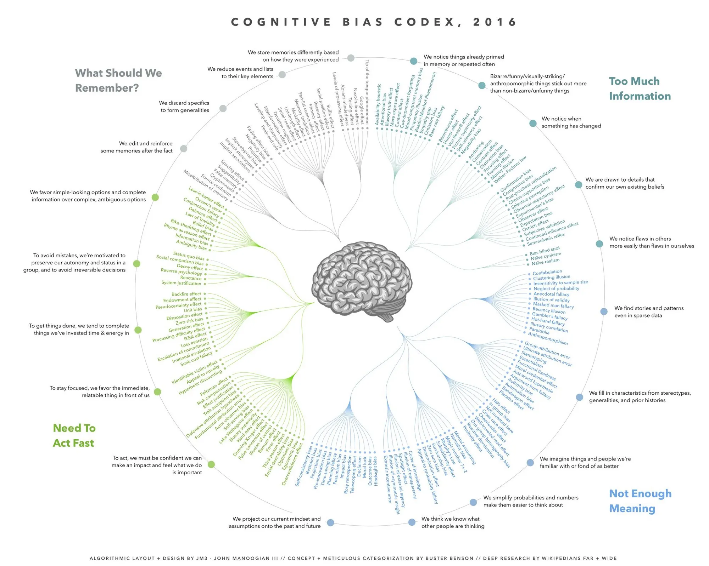

> A list I keep coming back to stay informed and neutral as possibly needed.

### 1.  Too Much Information
#### 1.1.  We notice things already primed in memory or repeated often

1. **Availability heuristic**: A mental shortcut that relies on immediate examples that come to mind when evaluating a specific topic, concept, or decision.
2. **Attentional bias**: The tendency to pay attention to some things while simultaneously ignoring others. This impacts both the accuracy of memories and decision-making ability.
3. **Illusory truth effect**: The tendency to believe information to be correct after repeated exposure, regardless of its actual veracity.
4. **Mere exposure effect**: A psychological phenomenon where people tend to develop a preference for things merely because they are familiar with them.
5. **Context effect**: The influence of environmental factors on one's perception of a stimulus.
6. **Cue-dependent forgetting**: The inability to recall information without the presence of memory cues that were available when the information was encoded.
7. **Mood-congruent memory bias**: The tendency to recall information more easily when the emotional content matches one's current emotional state.
8. **Frequency illusion**: The phenomenon in which people who just learn or notice something start seeing it everywhere.
9. **Baader-Meinhof Phenomenon**: Another name for frequency illusion, where after noticing something for the first time, there is a tendency to notice it more often.
10. **Empathy gap**: The tendency to underestimate the influence of visceral drives on their own attitudes, preferences, and behaviors.
11. **Omission bias**: The tendency to judge harmful actions as worse than equally harmful omissions or inactions.
12. **Base rate fallacy**: The tendency to ignore base rate information and focus on specific information relating to the individual case.
#### 1.2.  Bizarre, funny, visually-striking, or anthropomorphic things stick out more than non-bizarre/unfunny things

1. **Bizarreness effect**: The tendency of bizarre material to be better remembered than common material.
2. **Humor effect**: The tendency of humorous items to be more easily remembered than non-humorous ones.
3. **Von Restorff effect**: The tendency for an item that "stands out like a sore thumb" to be more likely to be remembered than other items.
4. **Picture superiority effect**: The notion that concepts that are learned by viewing pictures are more easily and frequently recalled than concepts that are learned by viewing their written word form.
5. **Self-relevance effect**: The tendency for information relating to oneself to be better remembered than other information.
6. **Negativity bias**: The notion that things of a more negative nature have a greater effect on one's psychological state than neutral or positive things.
#### 1.3.  We notice flaws in others more easily than we notice flaws in ourselves

1. **Bias blind spot**: The tendency to see oneself as less biased than other people.
2. **Naive cynicism**: The tendency to expect more egocentric bias in others than in oneself.
3. **Naive realism**: The belief that we see reality as it really is, objectively and without bias.
#### 1.4.  We notice when something has changed

1. **Anchoring**: The tendency to rely too heavily on the first piece of information offered when making decisions.
2. **Conservation**: The understanding that certain properties of an object remain the same despite changes in appearance.
3. **Contrast effect**: The enhancement or diminishment of a weight or other measurement when compared to a recently observed contrasting object.
4. **Distinction bias**: The tendency to view two options as more dissimilar when evaluating them simultaneously than when evaluating them separately.
5. **Focusing effect**: The tendency to place too much importance on one aspect of an event, causing an error in accurately predicting the utility of a future outcome.
6. **Framing effect**: Drawing different conclusions from the same information, depending on how it is presented.
7. **Money illusion**: The tendency to think of currency in nominal rather than real terms.
8. **Weber-Fechner law**: The perception of change in a given stimulus is proportional to the initial stimulus.
#### 1.5.  We are drawn to details that confirm our own existing beliefs

1. **Confirmation bias**: The tendency to search for, interpret, and recall information in a way that confirms one's preexisting beliefs.
2. **Congruence bias**: The tendency to test hypotheses exclusively through direct testing, instead of testing possible alternative hypotheses.
3. **Post-purchase rationalization**: The tendency to persuade oneself through rational argument that a purchase was good value.
4. **Choice-support bias**: The tendency to remember one's choices as better than they actually were.
5. **Selective perception**: The tendency for expectations to affect perception.
6. **Observer-expectancy effect**: When a researcher's cognitive bias causes them to subconsciously influence the participants of an experiment.
7. **Experimenter's bias**: The tendency for experimenters to believe, certify, and publish data that agree with their expectations for the outcome of an experiment.
8. **Observer effect**: Changes that the act of observation will make on a phenomenon being observed.
9. **Exception bias**: The tendency to give undue weight to a few apparently special cases.
10. **Ostrich effect**: The tendency to ignore negative situations by metaphorically burying one's head in the sand.
11. **Subjective validation**: The perception that something is true if a subject's belief demands it to be true.
12. **Continued influence effect**: The tendency to believe previously learned misinformation even after it has been corrected.
13. **Semmelweis reflex**: The tendency to reject new evidence that contradicts established paradigms.
### 2.  Not Enough Meaning
#### 2.1.  We tend to find stories and data when looking at sparse data

1. **Confabulation**: The production of fabricated, distorted, or misinterpreted memories without the conscious intention to deceive.
2. **Clustering illusion**: The tendency to see patterns in random sequences.
3. **Insensitivity to sample size**: The tendency to under-expect variation in small samples.
4. **Neglect of Probability**: The tendency to completely disregard probability when making a decision under uncertainty.
5. **Anecdotal fallacy**: Using personal experience or an isolated example instead of sound arguments or compelling evidence.
6. **Illusion of validity**: Believing that our judgments are accurate, especially when available information is consistent or inter-correlated.
7. **Masked man fallacy**: The belief that if A=B, then any property of A must also be a property of B.
8. **Recency illusion**: The belief that things you have noticed only recently are in fact recent.
9. **Gambler's fallacy**: The mistaken belief that if something happens more frequently than normal during a given period, it will happen less frequently in the future.
10. **Illusory correlation**: Seeing a relationship between two variables when no such relationship exists.
11. **Pareidolia**: The tendency to see patterns in random stimuli (such as seeing faces in clouds).
12. **Anthropomorphism**: The tendency to attribute human characteristics to non-human things.
#### 2.2.  We fill in characteristics from stereotypes, generalities, and prior histories

1. **Group attribution error**: The tendency to believe the characteristics of an individual group member are reflective of the group as a whole.
2. **Ultimate attribution error**: The tendency to attribute positive acts by in-group members to their personality and negative acts to the environment, while attributing the opposite for out-group members.
3. **Stereotyping**: Expecting a group or person to have certain qualities without having real information about the individual.
4. **Essentialism**: Believing that things have a set of characteristics that make them what they are.
5. **Functional fixedness**: The inability to look beyond an object's common use to see its potential other uses.
6. **Moral credential effect**: The belief that having done something good allows one to do something bad without losing moral standing.
7. **Just-world hypothesis**: The tendency to believe that the world is fundamentally fair and people get what they deserve.
8. **Argument from fallacy**: Assuming that if an argument for a conclusion is fallacious, then the conclusion is false.
9. **Authority bias**: The tendency to attribute greater weight to the opinions of an authority figure.
10. **Automation bias**: The tendency to depend more on automated systems and their outputs than is appropriate.
11. **Bandwagon effect**: The tendency to believe things because many other people believe them.
12. **Placebo effect**: A beneficial effect produced by a treatment that cannot be attributed to the properties of the treatment itself.
#### 2.3.  We think we know what other people are thinking

1. **Illusion of transparency**: The tendency to overestimate how well other people can discern our emotional state.
2. **Curse of knowledge**: When better-informed people find it difficult to think about problems from the perspective of lesser-informed people.
3. **Spotlight effect**: The tendency to overestimate how much other people notice our appearance or behavior.
4. **Extrinsic incentive error**: When people think others are more motivated by external rewards than they actually are.
5. **Illusion of external agency**: The tendency to view our own actions as originating from external influences rather than personal choice.
6. **Illusion of asymmetric insight**: People perceive their knowledge of others to surpass other people's knowledge of them.
#### 2.4.  We imagine things and people we're familiar with or fond of as better

1. **Out-group homogeneity bias**: The tendency to see members of out-groups as more similar to each other than members of in-groups.
2. **Cross-race effect**: The tendency to more easily recognize faces of one's own race.
3. **In-group bias**: The tendency to favor members of one's own group over those in other groups.
4. **Halo effect**: The tendency for an impression created in one area to influence opinion in another area.
5. **Cheerleader effect**: The phenomenon where people appear more attractive in a group than in isolation.
6. **Positivity effect**: The tendency to remember pleasant items more accurately than unpleasant ones.
7. **Not invented here**: Aversion to using products, research, or knowledge from external origins.
8. **Reactive devaluation**: Devaluing proposals only because they purportedly originated with an adversary.
9. **Well-traveled road effect**: The tendency to underestimate the duration of familiar journeys.
#### 2.5.  We simplify probabilities and numbers to make them easier to think about

1. **Mental accounting**: Treating money differently depending on its source or intended use.
2. **Appeal to probability fallacy**: The assumption that because something is possible, it is inevitable.
3. **Normalcy bias**: The refusal to plan for, or react to, a disaster which has never happened before.
4. **Murphy's Law**: The adage that "anything that can go wrong, will go wrong."
5. **Zero-sum bias**: The belief that a situation is zero-sum when it is actually non-zero-sum.
6. **Survivorship bias**: Concentrating on people or things that "survived" some process while overlooking those that didn't.
7. **Subadditivity effect**: The tendency to judge probability of the whole to be less than the probabilities of the parts.
8. **Denomination effect**: The tendency to spend more money when it's denominated in small amounts.
9. **Magic number 7+-2**: The observation that humans can only hold 7 (plus or minus 2) items in working memory.
#### 2.6.  We project our current mindset and assumptions onto the past and future

- **Self-consistency bias**: The tendency to maintain consistency between our current attitudes and memories of past behaviors.
- **Resistant bias**: The tendency to resist changes to beliefs when presented with contradictory evidence.
- **Projection bias**: The tendency to overestimate how much our future selves will share our current preferences.
- **Pro-innovation bias**: The tendency to have an excessive optimism towards an innovation's usefulness.
- **Time-saving bias**: Underestimating the time saved when increasing from a relatively low speed and overestimating time saved when increasing from a relatively high speed.
- **Planning fallacy**: The tendency to underestimate task-completion times.
- **Pessimism bias**: The tendency to overestimate the likelihood of negative events.
- **Impact bias**: Overestimating the length or intensity of future emotional states.
- **Declinism**: The belief that a society or institution is tending towards decline.
- **Moral luck**: The tendency to retroactively assign blame based on outcome rather than intent.
- **Outcome bias**: Judging a decision based on its outcome rather than how exactly the decision was made.
- **Hindsight bias**: The tendency to see past events as being predictable.
- **Rosy retrospection**: The tendency to rate past events more positively than they were rated when they occurred.
- **Telescoping effect**: The tendency to perceive recent events as being more remote in time and remote events as being more recent.
### 3.  Need to Act Fast
#### 3.1.  We favor simple-looking options and complete information over complex, ambiguous options

1. **Less-is-better effect**: The tendency to prefer a smaller set of options over a larger one, even when the larger set objectively provides more value.
2. **Occam's razor**: The tendency to prefer simpler explanations over more complex ones.
3. **Conjunction fallacy**: The assumption that specific conditions are more probable than general ones.
4. **Delmore effect**: The tendency to believe in a solution's effectiveness proportional to its complexity.
5. **Law of Triviality**: The tendency to give disproportionate weight to trivial issues.
6. **Bike-shedding effect**: The tendency to focus on minor details while avoiding complex issues (another name for Law of Triviality).
7. **Rhyme as reason effect**: The tendency to judge rhyming statements as more truthful than non-rhyming ones.
8. **Belief bias**: The tendency to evaluate the logical strength of an argument based on the believability of its conclusion.
9. **Information bias**: The tendency to seek information even when it cannot affect action.
10. **Ambiguity bias**: The tendency to avoid options with unknown probabilities in favor of options with known probabilities.
#### 3.2.  To get things done, we tend to complete things we've invested time & energy in

1. **Backfire effect**: When presented with contradictory evidence, beliefs get stronger.
2. **Endowment effect**: The tendency to value things more highly simply because we own them.
3. **Processing difficulty effect**: The tendency to believe that information that is harder to process must be more valuable or important.
4. **Pseudocertainty effect**: The tendency to make risk-averse choices if the expected outcome is positive, but risk-seeking choices to avoid negative outcomes.
5. **Disposition effect**: The tendency to sell assets that have increased in value while keeping assets that have decreased in value.
6. **Zero-risk bias**: Preference for reducing a small risk to zero over a greater reduction in a larger risk.
7. **Unit bias**: The tendency to want to complete a unit of a task or an item.
8. **IKEA effect**: The tendency to place higher value on products that we partially created.
9. **Loss aversion**: The tendency to prefer avoiding losses over acquiring equivalent gains.
10. **Generation effect**: The tendency to better remember information when we've generated it ourselves.
11. **Escalation of commitment**: Continuing an endeavor due to previously invested resources.
12. **Irrational escalation**: Increasing investment in a decision despite new evidence suggesting it's failing.
13. **Sunk cost fallacy**: Continuing an endeavor due to previously invested resources, even when it's no longer worthwhile.
#### 3.3.  To act, we must be confident we can make an impact and feel what we do is important

1. **Peltzman effect**: The tendency to take greater risks when safety measures are in place.
2. **Risk compensation**: The tendency to take greater risks when perceived safety increases.
3. **Effort Justification**: The tendency to value outcomes that we had to work hard to achieve.
4. **Trait ascription bias**: The tendency to view ourselves as relatively variable in terms of personality, behavior and mood while viewing others as more predictable.
5. **Defensive attribution hypothesis**: Attributing more blame to a victim the more similar they are to ourselves.
6. **Fundamental attribution error**: The tendency to overemphasize personality-based explanations for others' behaviors while underemphasizing situational explanations.
7. **Illusory superiority**: Overestimating one's own qualities and abilities relative to others.
8. **Illusion of control**: The tendency to overestimate one's control over external events.
9. **Actor-observer bias**: The tendency to attribute our own actions to external causes while attributing others' behaviors to internal causes.
10. **Self-serving bias**: The tendency to claim more responsibility for successes than failures.
11. **Barnum effect**: The tendency to accept vague and general personality descriptions as uniquely applicable to ourselves.
12. **Forer effect**: Another name for the Barnum effect.
13. **Optimism bias**: The tendency to be overly optimistic about future outcomes.
14. **Egocentric bias**: The tendency to rely too heavily on our own perspective when considering others'.
15. **Dunning-Kruger effect**: When unskilled individuals mistakenly assess their ability to be much higher than it is.
16. **Lake Wobegone effect**: The tendency to overestimate one's capabilities and see oneself as above average.
17. **Hard-easy effect**: The tendency to overestimate our ability to accomplish hard tasks and underestimate our ability to accomplish easy tasks.
18. **False consensus effect**: The tendency to overestimate how much others agree with us.
19. **Third-person effect**: Believing that mass communicated media messages have a greater effect on others than on themselves.
20. **Social desirability bias**: The tendency to answer questions in a manner that will be viewed favorably by others.
21. **Overconfidence effect**: Excessive confidence in one's own answers to questions.
#### 3.4.  To avoid mistakes, we aim to preserve autonomy and group status and avoid irreversible decisions

1. **Status quo bias**: The tendency to prefer things to stay the same.
2. **Social comparison bias**: Having a preference for or against someone based on how they compare to us.
3. **Decoy effect**: The tendency for preferences to change when presented with a third, less desirable option.
4. **Reactance**: The urge to do the opposite of what someone wants you to do.
5. **Reverse psychology**: Technique of advocacy of one message to trigger the response of adopting the contrary position.
6. **System justification**: The tendency to defend and bolster the status quo.
#### 3.5.  To stay focused, we favor the immediate, relatable thing in front of us

1. **Identifiable victim effect**: The tendency to respond more strongly to a single identified person at risk than to a large group of people at risk.
2. **Appeal to novelty**: The tendency to believe that new things are automatically better than old ones.
3. **Hyperbolic discounting**: The tendency to prefer immediate payoffs to later payoffs.
### 4.  What Should We Remember?
#### 4.1.  We store memories differently based on how they are experienced

1. **Tip of the tongue phenomenon**: The feeling that a forgotten word or name is right on the verge of being remembered.
2. **Google effect**: The tendency to forget information that can be easily found online.
3. **Next-in-line effect**: The reduced ability to recall information about events that occurred while anxiously awaiting one's turn to speak.
4. **Testing effect**: The finding that taking a test on material can be more beneficial for memory than studying.
5. **Absent-mindedness**: When attention lapses lead to memory failures.
6. **Levels of processing effect**: The tendency to remember information better when it has been processed more deeply and meaningfully.
#### 4.2.  We reduce events and lists to their key elements

1. **Suffix effect**: The impairment in recall of the last few items in a list when an irrelevant item is added to the end.
2. **Serial position effect**: The tendency to recall the first and last items in a series best, and the middle items worst.
3. **Part-list cueing effect**: When providing a portion of items from a list as memory cues makes it harder to recall the other items.
4. **Recency effect**: The tendency to better remember the most recently presented items in a series.
5. **Primary effect**: The tendency to better remember items that appear first in a series.
6. **Memory inhibition**: The ability to suppress irrelevant or unwanted memories to focus on relevant ones.
7. **Modality effect**: The tendency to have better memory recall for the last few items in a list when they are presented verbally rather than visually.
8. **Duration neglect**: The tendency to disregard the length of an experience when assessing its unpleasantness or pleasantness.
9. **List-length effect**: The observation that recognition performance decreases as the length of the list to be remembered increases.
10. **Serial recall effect**: The tendency for recall to be better when items are retrieved in the same order as they were learned.
11. **Misinformation effect**: When post-event information interferes with the memory of the original event.
12. **Leveling and sharpening**: Memory distortions where certain elements are diminished or emphasized when recalling a story.
13. **Peak-end rule**: The tendency to judge an experience largely based on how it was at its peak and at its end.
#### 4.3.  We discard specifics to form generalities

1. **Fading affect bias**: The tendency for negative emotions associated with memories to fade more quickly than positive emotions.
2. **Negativity bias**: The tendency to weight negative experiences more heavily than positive ones.
3. **Prejudice**: A preconceived opinion not based on actual experience.
4. **Stereotypical bias**: The tendency to remember information that confirms existing stereotypes and forget information that contradicts them.
5. **Implicit stereotypes**: The unconscious attribution of particular qualities to a member of a particular group.
6. **Implicit association**: The automatic association between mental representations of objects in memory.
7. **Spacing effect**: The phenomenon where learning is greater when studying is spread out over time rather than concentrated in a short period.
8. **Suggestibility**: The tendency to incorporate misleading information from external sources into personal memories.
9. **False memory**: The phenomenon where a person recalls something that did not happen or recalls it differently from the way it actually happened.
10. **Cryptomnesia**: When a forgotten memory returns without being recognized as such, leading to unintended plagiarism.
11. **Source confusion**: The inability to remember where, when, or how previously learned information was acquired.
12. **Misattribution of memory**: When memories are attributed to the wrong source; a type of source confusion where memories are mistakenly ascribed to a different origin.

 
 
 

And thanks to Mr John Manoogian III for this beautiful graphic.

