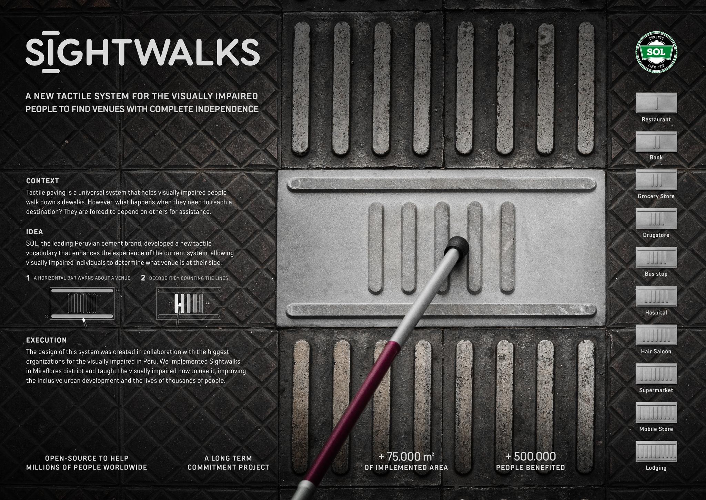

> [!TLDR] TLDR
> Peak problem-solving is creating an elegant solution.

## some challenges of everyday problem solving:

1) the limited availability of viable solutions due to characteristics of the problem itself.
2) whether the solution is sustainable in terms of cost or resources needed
3) whether the solution can be scaled or adapted to resolve similar problems or variations of such problem.

> an elegant solution has to be simple but effective.

A solution which might not be qualified as elegant, doesn't mean it is not good. The nature of the problem might need the solution to be complex or sophisticated to an extent to be effective. This in return renders the solution to be unsustainable, unscalable, or both. An elegant solution is rare, unusual, and likely unsuitable for the practical demand of business and the world. Also, the occurrence of the problem in the beginning could have already been a redundancy which makes a good solution impossible. 

## elegant solutions I found (tbu)
### Sightwalks 

source: https://www.lovethework.com/work-awards/entries/718872

### VanMoof bikes mishandled in transit
In 2015, VanMoof began shipping its bikes to the United States. However, a significant number arrived damaged upon delivery. This proved both frustrating for customers and costly for the company. While it couldn’t be confirmed definitively, it appeared that handling standards in the U.S. were not as careful as anticipated. So they had an idea - putting an image of a TV on every box. 

![[../attachments/11a64bd4007471453a19c23c06a01df2_MD5.png]]
source: https://www.vanmoof.com/blog/en/tv-bike-box

### Bus entry-exit interference
